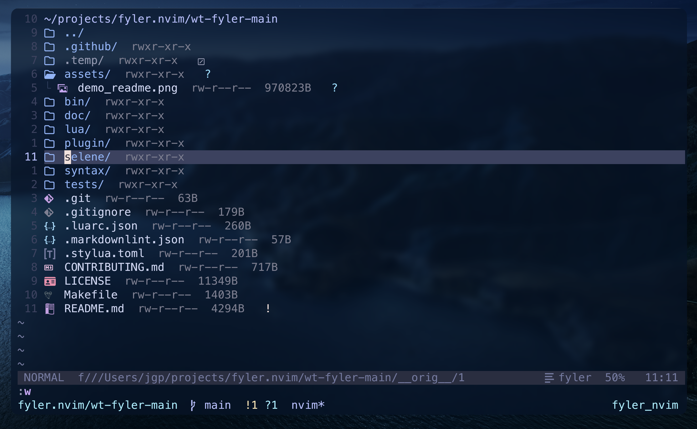

<div align="center">
  <h1>Fyler.nvim</h1>
    Best file manager for neovim, edit your filesystem the vim way, like a normal neovim buffer
</div>

<br>

<div align="center">
  
</div>

## Demo

A detailed walkthrough of this fork and its features:

[](https://www.youtube.com/watch?v=bwq8AVIh2QY)

## What's different from upstream

This fork ([jugarpeupv/fyler.nvim](https://github.com/jugarpeupv/fyler.nvim)) builds on
[A7Lavinraj/fyler.nvim](https://github.com/A7Lavinraj/fyler.nvim) with:

> [!NOTE]
> Some of this features might already be implemented in upstream

- **Support operations in multiple independent instances** — `require("fyler").open({ dir = ... })` opens
  a second directory in its own instance instead of hijacking the first buffer.
- **Permissions rendered as real editable text** — edit the `rwxr--r--`
  string inline and `:w` to chmod; invalid values warn and restore.
- **Inline size column rendered as real text** — file sizes render as real buffer text (`11349B`) with
  their own `FylerSize` highlight group. Edits to it are ignored and restored.
- **Editable cwd header with `../` navigation** — the first line shows the
  current directory as real text (edit it and press `<CR>` to jump there),
  and pressing `<CR>` on the `../` second line goes to the parent directory.
- **`ToggleDetails` action** — show/hide the permissions and size text together.
- **`SelectIfDirectory` action** — runs `Select` on directories, falls through to
  the builtin motion on files.
- **Executable files stand out** — files with any execute bit show a console
  icon with the `FylerExecutable` highlight (which prefers oil.nvim's
  `OilExecutable` when defined, green otherwise).
- **Smart `b` motion** — from the filename start, `b` jumps to the previous
  line's size instead of getting stuck in the concealed ref-id.
- **Splits keep fyler open** — `SelectVSplit`/`SelectSplit` no longer wipe the
  fyler pane, and toggling/closing in a multi-split `replace` layout closes the
  pane instead of swapping in a stale buffer.
- **Reliable `:e` / `:w`** — `:e` reloads the view instead of blanking the
  buffer, and a write handler is always present (no `E676`).
- **Cross-device moves** — `EXDEV` falls back to copy + delete, and paste targets the directory under the cursor.
- **Trash without double confirmation** — a missing or failing macOS trash
  backend deletes permanently directly; already-trashed files count as success.

## Installation

```lua
{
  "jugarpeupv/fyler.nvim",
  lazy = false, -- Necessary for `default_explorer` to work properly
  opts = {}
}
```

## Usage

You can either open fyler by using the `Fyler` command:

```vim
:Fyler             " Open the finder
:Fyler dir=<cwd>   " Use a different directory path
:Fyler kind=<kind> " Open specified window kind directly

" Map it to a key
nnoremap <leader>e <cmd>Fyler<cr>
```

```lua
-- Or via lua api
vim.keymap.set("n", "<leader>e", "<cmd>Fyler<cr>", { desc = "Open Fyler View" })
```

Or using the lua api:

```lua
local fyler = require('fyler')

-- open using defaults
fyler.open()

-- open as a left most split
fyler.open({ kind = "split_left_most" })

-- open with different directory
fyler.open({ dir = "~" })

-- You can map this to a key
vim.keymap.set("n", "<leader>e", fyler.open, { desc = "Open fyler View" })

-- Wrap in a function to pass additional arguments
vim.keymap.set(
    "n",
    "<leader>e",
    function() fyler.open({ kind = "split_left_most" }) end,
    { desc = "Open Fyler View" }
)
```

> [!NOTE]
> Run `:help fyler.nvim` OR visit [wiki pages](https://github.com/A7Lavinraj/fyler.nvim/wiki) for more detailed explanation and live showcase.

### Credits

- [**GrugFar**](https://github.com/MagicDuck/grug-far.nvim)
- [**Mini.files**](https://github.com/nvim-mini/mini.files)
- [**Neogit**](https://github.com/NeogitOrg/neogit)
- [**Nvim-window-picker**](https://github.com/s1n7ax/nvim-window-picker)
- [**Oil**](https://github.com/stevearc/oil.nvim)
- [**Snacks**](https://github.com/folke/snacks.nvim)
- [**Telescope**](https://github.com/nvim-telescope/telescope.nvim)

---

<h4 align="center">Built with ❤️ for the Neovim community</h4>
<a href="https://github.com/A7Lavinraj/fyler.nvim/graphs/contributors">
  
</a>
